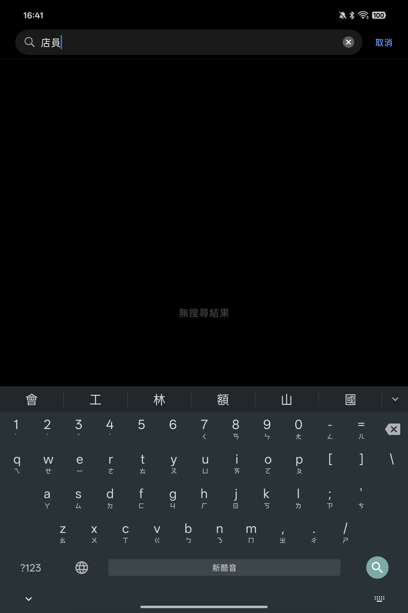

# Fcitx5 Android Eten 41 for OPPO Pad

An unofficial Fcitx5 for Android customization that provides a Windows-style
倚天 41-key Zhuyin keyboard and offline Traditional Chinese phrase
associations for the Chewing input method.

Tested on an OPPO Pad mini (`arm64-v8a`).



## Features

- Windows-style Eten 41 virtual-key arrangement, including the number row.
- Automatically uses the Eten layout while the Chewing input method is active.
- Related-character candidates appear immediately after a completed syllable.
- Typing the next Zhuyin key continues the phrase without requiring a candidate tap.
- Associations are generated from the official Chewing `tsi.csv` phrase
  dictionary and ranked by its frequency values.
- About 85,000 contexts, up to eight candidates per context, with as many as
  four preceding characters used for lookup.
- Fully offline; no text is sent to a server.

Examples:

- `如` -> `何`, `果`, `此`, `下`, `有`, `今`, `同`, `圖`
- `店` -> `員`, `區`, `市`, `面`, `家`, `名`
- Selecting `員` after `店` produces `店員` and continues with a new contextual row.

## Install

Download both APKs from the latest GitHub Release:

1. Install the main Fcitx5 Eten 41 APK.
2. Install the matching Chewing TSI Association plugin APK.
3. Enable Fcitx5 in Android's keyboard settings.
4. Open Fcitx5, add Chewing, and set Chewing's keyboard layout to Eten.

The APKs are debug-signed. Android may require uninstalling an app with the
same package name if it was signed with a different key. That removes the old
app's local settings, so export anything important first.

## Reproduce The Source

The customization is pinned to these upstream revisions:

- `fcitx5-android`: `048f581c652367567b8ee5c28c5163b805288895`
- `fcitx5-chewing`: `07eddb16961b18765e67cec538708b6964baa57c`
- Chewing dictionary: `ea74f76dd2548b1d65d0ff70c3ae66057a6ad97d`
  (`libchewing 0.11.0`)

```bash
git clone --recursive https://github.com/fcitx5-android/fcitx5-android.git
git -C fcitx5-android checkout 048f581c652367567b8ee5c28c5163b805288895
git -C fcitx5-android submodule update --init --recursive
./scripts/apply.sh ./fcitx5-android
cd fcitx5-android
./gradlew :app:assembleDebug :plugin:chewing:assembleDebug
```

JDK 17 and the Android build dependencies required by upstream Fcitx5 for
Android are needed.

## Association Data

[`generate_associations.py`](overlay/plugin/chewing/tools/generate_associations.py)
reads Chewing's structured CSV using Python's CSV parser. For each Han phrase,
it extracts one- through four-character contexts and accumulates the phrase
frequency for every possible next character. The eight highest-scoring
candidates are written to a deterministic TSV index.

The generated index is included at
[`associations.tsv`](overlay/plugin/chewing/src/main/association/usr/share/libchewing/associations.tsv).

## Project Layout

- `patches/fcitx5-android.patch`: Android keyboard integration and packaging.
- `patches/fcitx5-chewing.patch`: association loading and candidate behavior.
- `overlay/`: new source files and generated dictionary data.
- `scripts/apply.sh`: applies everything to the pinned upstream checkout.

## Licensing

This repository is an unofficial derivative of Fcitx5 for Android,
fcitx5-chewing, and Chewing dictionary data. The modifications and generated
dictionary index are distributed under `LGPL-2.1-or-later`. Upstream projects
retain their respective copyrights and licenses. See [NOTICE.md](NOTICE.md).
